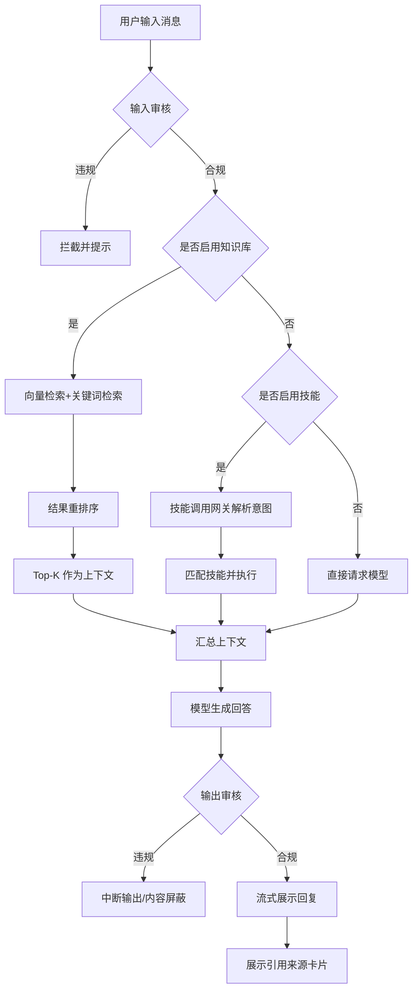
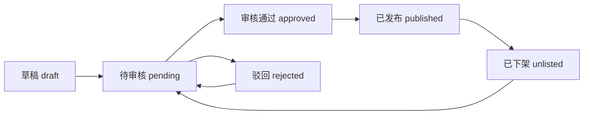
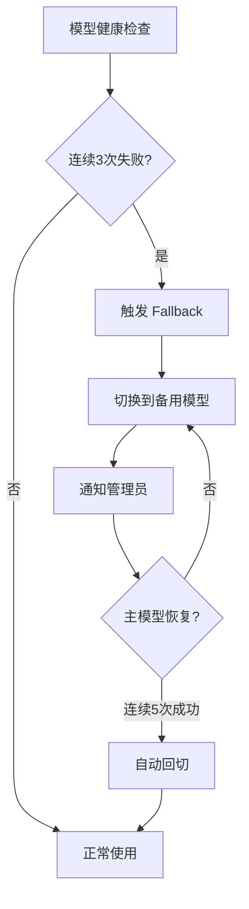

# Remi AI 智能平台 - 产品需求文档

## 1. 产品概述

### 1.1 产品定位
Remi AI 智能平台是一款面向企业的全能型 AI 协作平台，将智能对话、知识管理、技能市场与安全管控深度融合。平台采用"去专家化"的纯技能市场模式，提供开箱即用的 AI 能力，支持企业数据不出域的安全保障机制，和文档级的精细化权限控制。

### 1.2 目标用户
- **企业员工**：日常使用 AI 对话、知识库检索、安装使用技能
- **部门管理员**：管理本部门知识库、配置技能、查看使用统计
- **系统管理员**：用户管理、权限配置、模型路由、安全审核、全平台监控

### 1.3 核心价值
- 降低企业 AI 使用门槛，非技术人员也能轻松利用 AI 能力
- 保障企业数据安全，数据不出域、权限精细管控
- 通过技能市场实现 AI 能力可扩展、可复用

## 2. 核心功能

### 2.1 用户角色
- **普通用户**：使用智能对话、知识库检索、安装使用技能、个人设置
- **审核员**：内容安全审核、技能上架审核
- **管理员**：用户管理、权限配置、模型路由、知识库管理、全平台监控

### 2.2 功能模块

| 模块 | 优先级 | 功能描述 |
|------|--------|----------|
| 智能对话 | P0 | 多轮对话、流式输出、上下文管理、个人知识库检索、技能调用 |
| 知识库管理 | P0 | 多格式文档上传解析、分类管理、权限标注、RAG 检索、检索质量监控 |
| 技能管理 | P0 | 官方技能预置、技能市场、技能上架/下架审核、自定义技能开发、沙箱测试 |
| 用户及权限管理 | P0 | 注册登录、组织管理、RBAC+ABAC 混合权限模型 |
| 内容安全 | P0 | 输入输出双向审核、敏感词库管理、人工审核队列 |
| 模型管理 | P0 | 多模型路由、模型参数配置、用量统计、Fallback 容灾机制 |
| 日志管理 | P1 | 全链路操作日志、查询与导出 |
| Dashboard | P2 | BI 看板、使用统计与分析 |

### 2.3 关键页面

#### 2.3.1 智能对话页面
- **消息输入区**：底部多行输入框，支持 Enter 发送 / Shift+Enter 换行
- **对话列表**：左侧按时间倒序展示历史对话，支持搜索、收藏、删除
- **模型选择器**：对话输入框上方展示当前使用模型，点击下拉切换
- **技能选择器**：展示已安装技能列表，支持多技能同时启用
- **上下文管理**：对话区顶部展示上下文结构概览，支持手动截断
- **引用来源卡片**：AI 回复下方展示知识库引用卡片，含置信度标记

#### 2.3.2 知识库管理页面
- **上传页面**：拖拽或点击上传，支持 PDF/Word/Excel/Markdown/TXT
- **文件列表**：展示文件名称、大小、类型、上传时间、解析状态、分类
- **分类管理**：多级目录树，支持新建/编辑/删除/拖拽排序
- **权限批量标注**：批量设置文档可见范围（用户/角色/部门/全员）
- **检索质量监控**：用户反馈、管理员看板、质量报告

#### 2.3.3 技能市场页面
- **技能分类导航**：按类别展示，支持搜索和筛选
- **技能卡片**：展示技能名称、描述、安装量、评分、作者
- **技能详情页**：功能说明、参数配置、使用示例
- **安装/卸载操作**：一键安装，二次确认卸载

#### 2.3.4 管理后台
- **用户管理**：用户列表、组织架构、批量导入
- **角色权限**：预置角色管理、权限项配置、ABAC 规则自定义
- **模型管理**：模型路由配置、模型参数、用量统计、Fallback 链配置
- **安全审核**：审核队列、敏感词库管理、审核统计
- **操作日志**：日志查询、导出
- **Dashboard**：DAU、对话数、Token 消耗等核心指标看板

## 3. 核心流程

### 3.1 智能对话流程

### 3.2 技能上架审核流程

### 3.3 模型 Fallback 流程

## 4. 用户界面设计

### 4.1 设计风格
- 专业科技感：深色侧边栏 + 浅色内容区，蓝色主色调
- 清晰信息层级：卡片化布局，合理使用阴影和圆角
- 流畅的交互反馈：加载状态、过渡动画、微交互动效

### 4.2 页面结构
- **全局布局**：左侧导航栏 + 顶部 Header + 右侧内容区
- **导航菜单**：Dashboard、智能对话、知识库、技能市场、管理后台、个人设置
- **响应式设计**：支持 1280×720 以上分辨率

### 4.3 关键页面设计
- **对话页面**：左中右三栏布局 - 历史对话 | 对话区 | 上下文面板
- **知识库页面**：左侧分类树 + 右侧文件列表
- **技能市场**：顶部搜索和分类标签 + 卡片网格
- **管理后台**：顶部 tab + 左侧二级菜单 + 右侧内容
