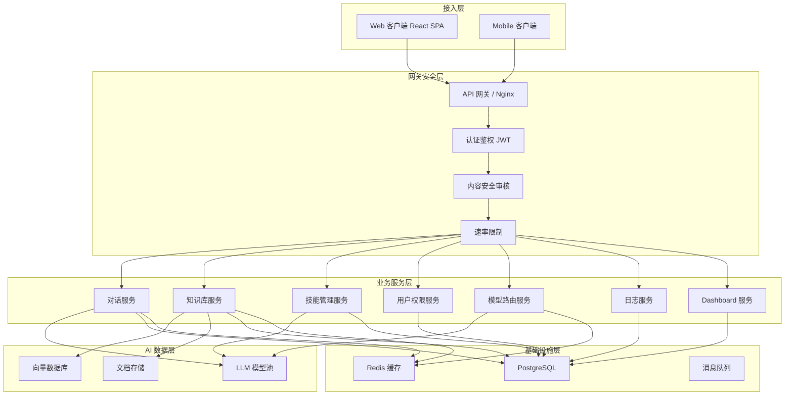

# Remi AI 智能平台 - 技术架构文档

## 1. 架构设计



## 2. 技术栈选型

| 层级 | 技术选型 | 说明 |
|------|----------|------|
| 前端框架 | React 18 + TypeScript | SPA 单页应用 |
| 构建工具 | Vite | 极速开发构建 |
| 样式方案 | Tailwind CSS | 原子化 CSS |
| 状态管理 | React Context + useState | 轻量级状态管理 |
| UI 组件库 | 自定义组件 | 基于设计系统定制 |
| 图表库 | Recharts | BI Dashboard 图表 |
| 图标库 | Lucide React | 统一图标风格 |
| 动画 | Framer Motion | 交互动画效果 |
| 后端模拟 | Mock API | 前端预览使用 mock 数据 |

## 3. 路由定义

| 路由 | 页面 | 权限 |
|------|------|------|
| `/` | Dashboard 首页 | 所有用户 |
| `/chat` | 智能对话 | 所有用户 |
| `/chat/:id` | 历史对话详情 | 所有用户 |
| `/knowledge` | 知识库管理 | 所有用户 |
| `/skills` | 技能市场 | 所有用户 |
| `/skills/:id` | 技能详情 | 所有用户 |
| `/admin/users` | 用户管理 | 管理员 |
| `/admin/roles` | 角色权限 | 管理员 |
| `/admin/models` | 模型管理 | 管理员 |
| `/admin/security` | 安全审核 | 管理员/审核员 |
| `/admin/logs` | 操作日志 | 管理员 |
| `/admin/dashboard` | 管理 Dashboard | 管理员 |
| `/settings` | 个人设置 | 所有用户 |

## 4. 数据模型

### 4.1 用户
```
User {
  id: string;
  username: string;
  email: string;
  role: 'user' | 'auditor' | 'admin';
  department: string;
  level: string;
  avatar: string;
  createdAt: string;
}
```

### 4.2 对话
```
Conversation {
  id: string;
  title: string;
  userId: string;
  model: string;
  skills: string[];
  knowledgeBaseEnabled: boolean;
  createdAt: string;
  updatedAt: string;
  isStarred: boolean;
}

Message {
  id: string;
  conversationId: string;
  role: 'user' | 'assistant' | 'system';
  content: string;
  citations: Citation[];
  timestamp: string;
}

Citation {
  id: string;
  documentName: string;
  snippet: string;
  confidence: number;
  pageNumber?: number;
}
```

### 4.3 知识库文档
```
Document {
  id: string;
  name: string;
  type: 'pdf' | 'docx' | 'xlsx' | 'markdown' | 'txt';
  size: number;
  category: string;
  status: 'uploading' | 'parsing' | 'ready' | 'failed';
  uploadTime: string;
  permissions: DocumentPermission[];
  errorMessage?: string;
}

DocumentPermission {
  type: 'user' | 'role' | 'department' | 'public';
  targetId: string;
  targetName: string;
}
```

### 4.4 技能
```
Skill {
  id: string;
  name: string;
  description: string;
  category: string;
  icon: string;
  author: string;
  version: string;
  status: 'draft' | 'published' | 'unlisted';
  installCount: number;
  rating: number;
  isInstalled: boolean;
  createdAt: string;
}
```

### 4.5 模型配置
```
ModelConfig {
  id: string;
  name: string;
  provider: string;
  modelId: string;
  isPrimary: boolean;
  temperature: number;
  maxTokens: number;
  fallbackChain: string[];
  status: 'active' | 'inactive' | 'error';
  usageCount: number;
  tokenCount: number;
}
```

## 5. 前端组件架构

```
src/
├── components/
│   ├── layout/
│   │   ├── Sidebar.tsx          # 左侧导航栏
│   │   ├── Header.tsx           # 顶部 Header
│   │   └── Layout.tsx           # 布局容器
│   ├── chat/
│   │   ├── ChatPanel.tsx        # 对话面板
│   │   ├── MessageBubble.tsx    # 消息气泡
│   │   ├── ChatInput.tsx        # 输入框
│   │   ├── ConversationList.tsx # 对话列表
│   │   ├── ModelSelector.tsx    # 模型选择器
│   │   ├── SkillSelector.tsx    # 技能选择器
│   │   └── CitationCard.tsx     # 引用卡片
│   ├── knowledge/
│   │   ├── UploadZone.tsx       # 上传区域
│   │   ├── FileList.tsx         # 文件列表
│   │   ├── CategoryTree.tsx     # 分类树
│   │   └── PermissionModal.tsx  # 权限弹窗
│   ├── skills/
│   │   ├── SkillCard.tsx        # 技能卡片
│   │   ├── SkillDetail.tsx      # 技能详情
│   │   └── SkillMarket.tsx      # 技能市场
│   ├── admin/
│   │   ├── UserManagement.tsx   # 用户管理
│   │   ├── RoleManagement.tsx   # 角色管理
│   │   ├── ModelManagement.tsx  # 模型管理
│   │   ├── SecurityPanel.tsx    # 安全审核
│   │   └── AdminDashboard.tsx   # 管理看板
│   └── dashboard/
│       ├── StatsCards.tsx       # 统计卡片
│       └── TrendChart.tsx       # 趋势图表
├── data/
│   └── mockData.ts              # Mock 数据
├── types/
│   └── index.ts                 # 类型定义
├── App.tsx                      # 应用入口
└── main.tsx                     # 渲染入口
```
